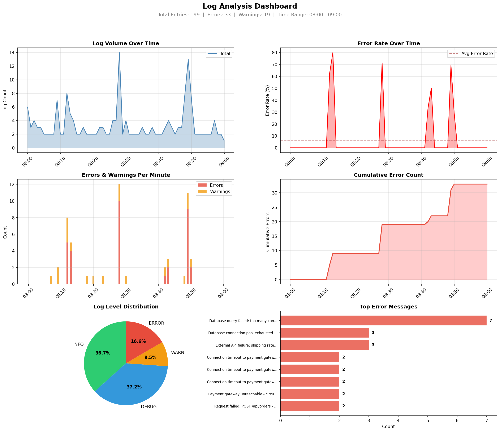

# 🚀 Weekend Projects

A collection of practical projects built to reinforce Data Structures & Algorithms concepts. Each project directly applies patterns commonly tested in technical interviews at top tech companies.

## 📋 Overview

This repository contains 4 projects that progressively build on core DSA patterns:

| Project | DSA Pattern | Status |
|---------|-------------|--------|
| URL Shortener | Arrays & Hashmaps | ✅ Complete |
| Log Analyzer CLI | Two Pointers & Sliding Window | ✅ Complete |
| Browser History Manager | Linked Lists & Stacks | 🔲 Not Started |
| File System Navigator | Trees & Recursion | 🔲 Not Started |

## 🛠️ Projects

### 1. URL Shortener
A URL shortening service similar to bit.ly that demonstrates hashmap operations for O(1) lookup and storage.

**<u>Why This Project?</u>**
- URL shorteners like bit.ly are a classic example of hashmaps in production. I wanted to understand how O(1) lookups make these services fast, and how bidirectional mapping (URL → code and code → URL) works in practice.

**<u>My Approach:</u>**
- I started with the core data structure—two hashmaps for instant lookups in both directions. Then I implemented Base62 encoding to generate short, unique codes. Once the basics worked, I added production-style features like expiration, analytics, and rate limiting to make it feel like a real service.

**<u>Key Concepts:</u>**
- Hashmap for bidirectional URL mapping
- Base62 encoding for short code generation
- Collision handling

**<u>Features:</u>**
- Shorten any URL to a unique code
- Expand short codes back to original URLs
- Duplicate URL detection
- CLI interface

**<u>Bonus Features:</u>**
- URL validation (http/https only)
- Expiration dates for short URLs
- Click analytics tracking (count & timestamps)
- Custom short codes (user-specified aliases)
- Data persistence to JSON file
- Rate limiting (10 requests per 60 seconds)

**<u>Run it:</u>**
```bash
cd url_shortener
python main.py

# Run tests
pytest tests/ -v
```

---

### 2. Log Analyzer CLI
A command-line tool that analyzes log files to find patterns, errors, and trends using sliding window techniques.

**<u>Why This Project?</u>**
- Real-world systems generate massive log files. I wanted to understand how sliding window and two pointer techniques can efficiently detect error spikes and patterns without loading entire files into memory - the same patterns used in production monitoring tools.

**<u>My Approach:</u>**
- I started by building a parser to turn raw log lines into structured data. Then I implemented a sliding window with a deque to detect error spikes in configurable time windows. For pattern detection, I used a hashmap to count normalized error messages. Once the core worked, I added multi-format support, anomaly detection, and data visualization.

**<u>Key Concepts:</u>**
- Sliding window for time-based error spike detection
- Two pointers for efficient time range analysis
- Hashmap for frequency counting and pattern detection

**<u>Features:</u>**
- Parse standard log file format
- Detect error spikes within configurable time windows
- Find repeated error patterns
- Generate summary statistics

**<u>Bonus Features:</u>**
- Real-time log tailing (like tail -f) with color-coded output
- Export analysis to JSON/CSV reports
- Error rate visualization with matplotlib
- Multi-format support (Apache, Nginx, JSON logs)
- Anomaly detection (unusual error rates, volume spikes, time gaps)

**<u>Run it:</u>**
```bash
cd log_analyzer
source venv/bin/activate
python3 cli.py sample_logs/server.log --errors --spikes 5 --patterns --anomalies --visualize

# Run tests
pytest tests/ -v
```

**<u>Sample Dashboard Output:</u>**



---

